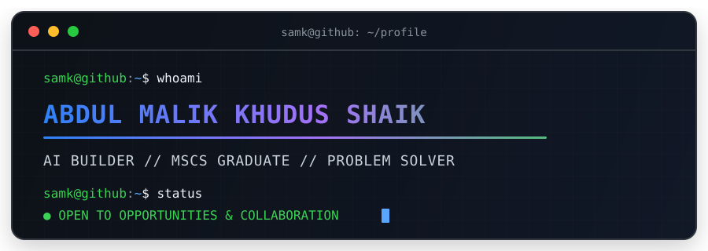

<div align="center">



</div>

## `samk@github ~ $ ./about.sh`

```text
Name       Abdul Malik Khudus Shaik
Education  M.S. in Computer Science · George Mason University
Focus      Artificial Intelligence · Machine Learning · Software Engineering
Status     Open to opportunities and collaboration
```

I am an AI builder who enjoys turning ideas and data into useful software. My interests span machine learning, cloud platforms, full-stack development, and the systems that bring intelligent products to life.

## `samk@github ~ $ ./toolbox.sh`

<p align="center">
  <strong>Languages</strong><br><br>
  
  
  
  
  
  
</p>

<p align="center">
  <strong>AI, ML &amp; Data</strong><br><br>
  
  
  
  
  
  
  
  
  
</p>

<p align="center">
  <strong>Platforms, Frameworks &amp; Databases</strong><br><br>
  
  
  
  
  
  
  
  
  
  
</p>

<p align="center">
  <strong>Developer Tools</strong><br><br>
  
  
  
</p>

## `samk@github ~ $ ls ./featured-builds`

<table>
  <tr>
    <td width="33%" valign="top">
      <h3><a href="https://github.com/SAMK-online/Connexted">CONNEXTed</a></h3>
      <p>A WhatsApp-first GTM workflow that turns event conversations into enriched leads, evidence-backed signals, and human-reviewed outreach.</p>
      <p><code>FastAPI</code> <code>React</code> <code>LangGraph</code> <code>Supabase</code></p>
    </td>
    <td width="33%" valign="top">
      <h3><a href="https://github.com/SAMK-online/Traceline">Traceline</a></h3>
      <p>A shared CPA and client tax workspace with role-aware workflows, source-linked field review, and inspectable AI reasoning.</p>
      <p><code>Next.js</code> <code>TypeScript</code> <code>Tailwind CSS</code> <code>Zustand</code></p>
    </td>
    <td width="33%" valign="top">
      <h3><a href="https://github.com/SAMK-online/AmigoAR">AR Autopilot</a></h3>
      <p>A healthcare receivables cockpit for aging analysis, risk-ranked accounts, and review-ready collection workflows.</p>
      <p><code>TypeScript</code> <code>Vite</code> <code>Anthropic</code> <code>Vercel</code></p>
    </td>
  </tr>
</table>

<p align="center">
  <a href="https://github.com/SAMK-online?tab=repositories"><strong>Explore all repositories →</strong></a>
</p>

<div align="center">

<h3><code>samk@github ~ $ ./links.sh</code></h3>

<p><strong>AI Builder · Software Engineer · MSCS Graduate</strong></p>

[](https://abdul-malik-portfolio.vercel.app/)
[](https://www.linkedin.com/in/abdul-malik-khudus-shaik-b46b161ab/)
[](https://x.com/SAMK_online)
[](mailto:shaikabdulmalik958@gmail.com)

<br><br>

<sub>Open to thoughtful AI projects, engineering challenges, and opportunities to build useful products with great people.</sub>

</div>
